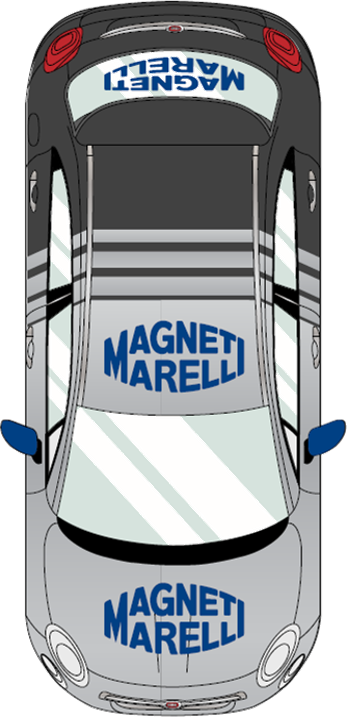

# SUMO RL Ego

`sumo-rl-ego` is a modular toolkit for SUMO-based ego-vehicle reinforcement learning. It combines a composable environment layer with a lightweight workflow API so you can build custom driving tasks, evaluate policies, and integrate training into your existing research stack without adopting a monolithic framework.

## At A Glance

- Modular SUMO environments built on reusable observation, reward, ego-control, and metrics components.
- Research-oriented workflow helpers for environment creation, policy wrapping, rollout, evaluation, and GUI play mode.
- Clear package boundaries between the environment toolkit and optional experiment infrastructure.
- Examples, built-in scenarios, and tests that make the repository easier to adopt and extend.

## Why This Project

Many SUMO RL repositories tightly couple environment design, experiment code, and training infrastructure. This project separates those concerns deliberately.

- `sumo_gym_ego` provides the environment construction layer.
- `sumo_rl_ego` provides the higher-level workflow layer.
- `experiments/` adds optional tooling around the package API rather than defining the core architecture.

The result is a cleaner foundation for researchers and developers who want both flexibility and a predictable public interface.

## Who It Is For

- Researchers who want to train with Stable-Baselines3 or custom pipelines while keeping environment logic modular.
- Developers who want ready-to-use SUMO ego-driving environments without rebuilding basic rollout and evaluation utilities.
- Teams who value explicit APIs, reusable components, and a straightforward path from packaged defaults to custom environments.

## Package Architecture

| Package | Role | What it provides |
| --- | --- | --- |
| `sumo_gym_ego` | Environment toolkit | `SumoEnv`, `SumoConfig`, plugin interfaces, composite plugins, and reusable modules under `obs`, `reward`, `ego`, and `metrics` |
| `sumo_rl_ego` | Workflow layer | `make_env`, `make_vec_env`, `Policy`, policy adapters/loaders, rollout helpers, evaluation, play mode, and registries for envs and policies |

### `sumo_rl_ego` folder structure

- `sumo_rl_ego/workflows/`: episode execution, rollout, evaluation, and play helpers
- `sumo_rl_ego/policies/`: policy interfaces, wrappers, registry, and built-in rule-based policies
- `sumo_rl_ego/sumo_envs/`: built-in environment registrations and packaged SUMO scenarios

Experiment-side Hydra and SB3 wiring lives under `experiments/`, not in the public packages.

### `sumo_gym_ego`

Use `sumo_gym_ego` when you want direct control over environment design.

Main public exports:

- `SumoEnv`
- `SumoConfig`
- `EgoStatus`
- `BaseEnvPlugin`
- `BaseEgoController`
- `BaseObservationBuilder`
- `BaseRewardFunction`
- `BaseMetricsTracker`
- `CompositePlugin`
- `CompositeObservation`
- `CompositeReward`
- `CompositeMetricsTracker`
- `obs`
- `reward`
- `ego`
- `metrics`

### `sumo_rl_ego`

Use `sumo_rl_ego` when you want a compact, researcher-friendly layer on top of the environment toolkit.

Main public exports:

- `make_env`
- `make_vec_env`
- `list_envs`
- `Policy`
- `policy_from_model`
- `load_policy`
- `list_policies`
- `run_episode`
- `rollout`
- `evaluate_policy`
- `play_policy`

## Engineering Qualities

The repository already exposes several signals of quality and maintainability:

- A clean split between low-level environment construction and high-level RL workflow helpers.
- A concise public API surfaced directly from both packages.
- Built-in registration for environments and policies, including `HighwayEgo-v0` and `safe_speed_v1`.
- Example scripts for environment creation, custom environments, training, and evaluation.
- Thin experiment entry points under `experiments/` for train, eval, and play workflows.
- Tests for public API behavior, rollout utilities, SUMO integration, and GUI-related flows.

Hydra, Weights & Biases, TensorBoard, and related tooling remain optional. They are available for experiment workflows without being coupled to the core packages.

## Install

The project expects a working SUMO installation with `sumo` available on your `PATH`.

- `libsumo` is used for headless execution.
- `traci` is used for GUI play mode.

### Minimal install

```bash
pip install -e .
```

### Full setup

This creates a local virtual environment, installs optional experiment and development dependencies, and checks for the `sumo` binary.

```bash
./setup.sh
```

Smoke test:

```bash
python -c "import sumo_rl_ego as sre; print(sre.list_envs())"
```

Optional experiment tooling only:

```bash
pip install -e ".[experiments]"
```

## Quickstart

### Create a built-in environment

```python
import sumo_rl_ego as sre

env = sre.make_env(
    "HighwayEgo-v0",
    seed=0,
    reward="fast",
    ego="discrete",
    use_gui=False,
)
```

This is the fastest path into the library: instantiate a ready-made environment and connect it to your own training or evaluation loop.

### Build a custom environment

```python
from pathlib import Path

import sumo_gym_ego as sge

scenario = Path("sumo_rl_ego/sumo_envs/scenarios/highway_fast_modified/highway.sumocfg")

env = sge.SumoEnv(
    sumocfg_files=[str(scenario)],
    config=sge.SumoConfig(use_gui=False, ego_id="ego", seed=0),
    ego_controller=sge.ego.HighwayDiscreteEgo(),
    obs_builder=sge.CompositeObservation([
        sge.obs.EgoSpeedObs(max_speed=50.0),
        sge.obs.EgoLaneObs(),
    ]),
    reward_function=sge.CompositeReward([
        sge.reward.StepPenalty(penalty=-0.2),
        sge.reward.SpeedReward(max_speed=50.0),
    ]),
    metrics_tracker=sge.CompositeMetricsTracker([
        sge.metrics.EgoFeatureMetrics(window=100),
    ]),
)
```

This lower-level path is intended for custom scenario design, reward shaping, observation design, and instrumentation.

## Typical Workflows

### Train with your own pipeline

```python
import sumo_rl_ego as sre
from stable_baselines3 import DQN

env = sre.make_vec_env(
    "HighwayEgo-v0",
    n_envs=8,
    base_seed=0,
    reward="fast",
    ego="discrete",
    use_gui=False,
)

model = DQN("MlpPolicy", env, learning_rate=5e-4, verbose=1)
model.learn(total_timesteps=200_000)
```

### Wrap a policy

```python
import sumo_rl_ego as sre


class KeepSpeedPolicy(sre.Policy):
    def predict(self, obs):
        return 0


policy = sre.policy_from_model(model)
policy = sre.policy_from_model(lambda obs: 0)
policy = sre.load_policy("safe_speed_v1")
```

### Evaluate behavior

```python
import sumo_rl_ego as sre

env = sre.make_env("HighwayEgo-v0", seed=0, reward="fast", ego="discrete")
policy = sre.load_policy("safe_speed_v1")

result = sre.evaluate_policy(env, policy, n_episodes=5, seed=0)
print(result.return_mean, result.event_counts)
env.close()
```

For interactive inspection, enable `use_gui=True` and use `play_policy(...)`.

## Scenario Gallery

The repository already includes static scenario previews that work well in a README and make the project feel much more tangible.

| Highway | Roundabout | Intersection |
| --- | --- | --- |
|  |  |  |

## Examples And Experiments

Examples under `examples/`:

- `examples/make_env.py`
- `examples/custom_env.py`
- `examples/train_with_sb3.py`
- `examples/evaluate_policy.py`

Experiment entry points under `experiments/`:

- `experiments/train.py`
- `experiments/eval.py`
- `experiments/play.py`

These scripts are intentionally thin wrappers around the package API. They add practical experiment tooling without changing the architecture of the library itself.
