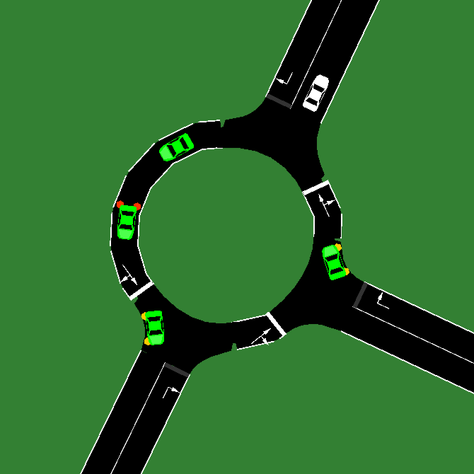
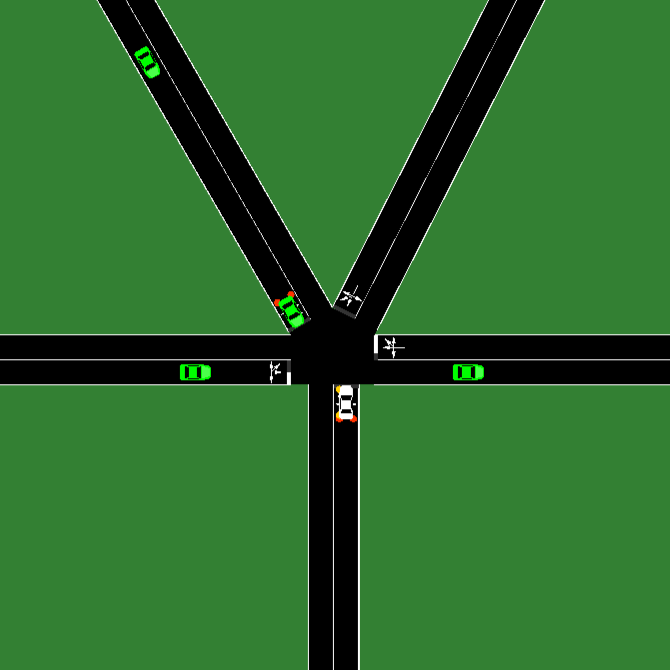
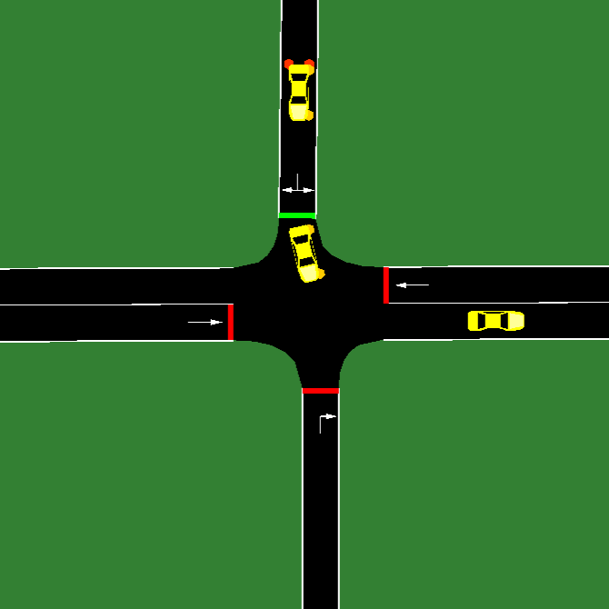

# sumo-rl-ego

Composable reinforcement learning environments for autonomous ego-vehicle control,
built on [SUMO](https://sumo.dlr.de) — the open-source microscopic traffic simulator.

---

<video src="assets/highway_video.mp4" controls autoplay loop width="100%"></video>

---

### Scenarios

| Highway | Roundabout | T-intersection | 5-way | Crossroads |
|:---:|:---:|:---:|:---:|:---:|
|  |  |  |  |  |

---

## What it is

[SUMO](https://sumo.dlr.de) simulates thousands of vehicles across realistic road networks.
This library wraps it with a [Gymnasium](https://gymnasium.farama.org)-compatible interface
where every part of the environment — observations, rewards, ego-vehicle control, and metrics —
is a swappable plugin, composable without touching the rest.

The result is a clean foundation for reward shaping experiments, behavioral evaluation,
and custom scenario design, without adopting a monolithic framework.

---

## Architecture

```
┌─ sumo_gym_ego ──────────────────────────────────────────────┐
│                                                             │
│   obs/          reward/         ego/         metrics/       │
│   EgoSpeedObs   HighSpeedRew    DiscreteEgo  ActionRate     │
│   NeighborObs   ComfortRew      ContinuousEgo AvgSpeed      │
│   LaneFreeObs   TerminalRew     ...          Reward2Metrics │
│        │              │              │             │        │
│        └──────────────┴──────────────┴─────────────┘        │
│                  CompositeObservation                       │
│                  CompositeReward                            │
│                  CompositeMetricsTracker                    │
│                            │                                │
│                      SumoEnv  (Gymnasium API)               │
│                  make_env · make_vec_env                    │
└─────────────────────────────────────────────────────────────┘
                             │
┌─ sumo_rl_ego ───────────────────────────────────────────────┐
│   load_policy · run_episode · play_policy                   │
└─────────────────────────────────────────────────────────────┘
                             │
┌─ experiments/  (optional) ──────────────────────────────────┐
│   Hydra configs · Stable-Baselines3 · Weights & Biases      │
└─────────────────────────────────────────────────────────────┘
```

`sumo_gym_ego` has no dependency on `sumo_rl_ego`.
Both packages expose stable, independent public APIs.

---

## What makes it interesting

### Environments built from composable pieces

Every component — observation, reward, ego controller, metrics — is a plugin
with a standard `bind / reset` lifecycle. Compose them freely, swap one without touching the rest:

```python
import sumo_gym_ego as sge

env = sge.SumoEnv(
    config=sge.SumoConfig(ego_id="ego", use_gui=False),
    obs_builder=sge.CompositeObservation([
        sge.obs.EgoSpeedObs(max_speed=50.0),
        sge.obs.NeighborObs(neighbors=["same_front", "left_front", "right_front"]),
        sge.obs.LaneFreeObs(check_distance=20.0),
    ]),
    reward_function=sge.CompositeReward([
        sge.reward.HighSpeedReward(max_speed=50.0, weight=1.0),
        sge.reward.ComfortReward(w_acc=0.5, w_jerk=0.5),
        sge.reward.TerminalReward(w_crash=-50.0, w_arrived=20.0),
    ]),
    ego_controller=sge.ego.HighwayDiscreteEgo(),
)
```

### Reward decomposition without changing the reward function

`Reward2Metrics` wraps any reward function and tracks its contribution as a separate
logged metric — without touching training or the reward itself.
Useful for reward shaping experiments where you want to see how each component evolves:

```python
metrics_tracker=sge.CompositeMetricsTracker([
    sge.metrics.AvgSpeedMetrics(),
    sge.metrics.Reward2Metrics(reward_fast,   reward_name="ep_fast_return"),
    sge.metrics.Reward2Metrics(reward_comfort, reward_name="ep_comfort_return"),
])
```

Both components are logged to W&B / TensorBoard each episode, independently.

### Real-time visualization

`play_policy` runs an episode interactively — step by step or at full speed —
with an optional live dashboard showing observations, action distribution,
step reward, and cumulative reward updated every frame:

```python
from sumo_rl_ego import play_policy, WindowDisplay

play_policy(env, policy, auto=True, delay=0.05, display=WindowDisplay())
```

---

## Install

Requires [SUMO](https://sumo.dlr.de/docs/Installing/index.html) with `sumo` on your `PATH`.

```bash
pip install -e .
```

Full setup — creates a virtual environment, installs optional dependencies, checks for `sumo`:

```bash
./setup.sh
```

Smoke test:

```bash
python -c "from sumo_gym_ego.sumo_envs.registry import list_envs; print(list_envs())"
```

---

## Quickstart

```python
import sumo_gym_ego as sge
import sumo_rl_ego as sre

env    = sge.make_env("HighwayEgo-v0", reward="fast", ego="discrete", seed=0)
policy = sre.load_policy("FastPolicy-v0")

info = sre.run_episode(env, policy)
print(info)
env.close()
```

Train with [Stable-Baselines3](https://stable-baselines3.readthedocs.io):

```python
import sumo_gym_ego as sge
from stable_baselines3 import DQN

env   = sge.make_vec_env("HighwayEgo-v0", n_envs=8, reward="fast", ego="discrete")
model = DQN("MlpPolicy", env, verbose=1)
model.learn(total_timesteps=500_000)
```

---

## Examples

| File | What it shows |
|---|---|
| [`examples/make_env.py`](examples/make_env.py) | Create and step through a built-in environment |
| [`examples/custom_env.py`](examples/custom_env.py) | Build a fully custom environment from scratch |
| [`examples/train_with_sb3.py`](examples/train_with_sb3.py) | Train with Stable-Baselines3 |
| [`examples/evaluate_policy.py`](examples/evaluate_policy.py) | Evaluate a policy and inspect metrics |

Experiment entry points under [`experiments/`](experiments/) add Hydra config management,
W&B logging, and fine-tuning support as a thin layer on top of the package API.
